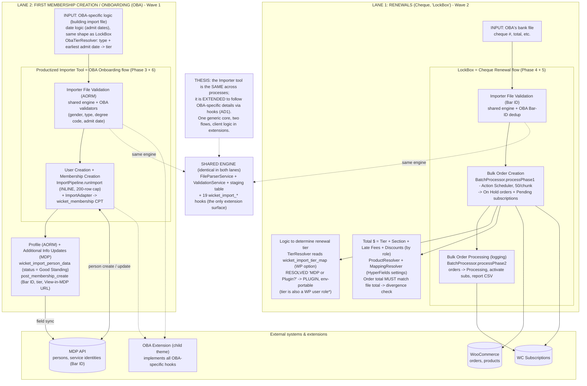
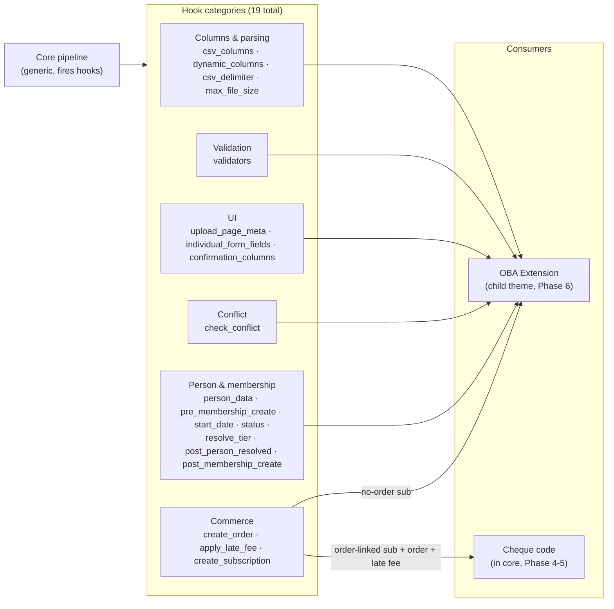
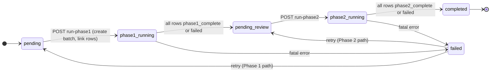

# System Flow Diagrams

Visual maps of how the importer works. Mirrors the original hand-drawn two-lane flow, enriched with the planned implementation. Text detail lives in [import pipeline](import-pipeline.md) and [hooks](hooks.md); this page is the at-a-glance visual companion.

## Legend

| Shape / line | Meaning |
|---|---|
| `[box]` | component or step |
| `{diamond}` | decision |
| `[(cylinder)]` | data store (DB table or external API) |
| dotted `-.->` | a shared engine, or a `wicket_import_*` hook firing into the extension layer |
| solid `-->` | data or control flow |

---

## 1. Two-lane system map

The importer is the SAME tool across two processes; it is EXTENDED to follow client-specific details via hooks (AD1). One generic core, two flows, client logic in extensions.

Lane 1 (Renewals / LockBox) is Wave 2; Lane 2 (Onboarding) is Wave 1.

\* Tier is resolved via `TierResolver` + the `wicket_import_tier_map` option. Discounts/fees are role-based; `MappingResolver` loads roles fresh from DB (not stale member data).

### Hand-drawn original to implementation mapping

| Original element | Lane | Planned implementation |
|---|---|---|
| OBA's bank file (cheque #, total) | Renewals | Cheque CSV input, Phase 4 task 15.0 |
| LockBox: Importer File Validation (Bar ID) | Renewals | FileParserService + ValidationService + OBA Bar-ID dedup |
| LockBox: Bulk Order Creation | Renewals | `Cheque\BatchProcessor::processPhase1` (Action Scheduler) |
| LockBox: Bulk Order Processing (logging) | Renewals | `processPhase2` + `Reports\ReportGenerator` |
| Logic to determine renewal tier + "(MDP or Plugin?)" | Renewals | `TierResolver` on WP option. Resolved: plugin-side, env-portable |
| Total $ = Tier + Section + Late Fees + Discounts | Renewals | `ProductResolver` + `MappingResolver` (HyperFields) |
| Order total must match file total | Renewals | total divergence check on ReviewPage |
| OBA import file logic (date logic) | Onboarding | `ObaTierResolver` admit-date mapping |
| Productized Importer Tool: Validation (AORM) | Onboarding | FileParserService + ValidationService + OBA validators |
| Productized Importer Tool: User + Membership Creation | Onboarding | `ImportPipeline::runImport` + `ImportAdapter` |
| Profile (AORM) + Additional Info Updates (MDP) | Onboarding | `wicket_import_person_data` + `wicket_import_post_membership_create` |
| Note: same tool, extended for OBA | both | AD1: generic core, client logic via hooks |

---

## 2. Shared engine and extension hook surface

Why it is one tool. The core has zero client domain knowledge; every customization is a `wicket_import_*` hook. This shows the hook categories and who consumes them.

Full signatures for all 19 hooks: [hooks](hooks.md).

---

## 3. LockBox (Cheque) batch lifecycle

The `wicket_import_batches` record drives the two-phase cheque flow (Phase 4-5, Wave 2). Each phase is an Action Scheduler loop that reschedules itself until rows are exhausted.

Row-level `import_status` within a batch: `pending` -> `phase1_complete` (or `needs_review` / `failed`) -> `phase2_complete` (or `needs_review` / `failed`).

The OBA flow instead uses: `pending` -> `imported` / `updated` / `skipped` / `failed` / `email_conflict` / `skipped_active_membership` / `needs_review`. `needs_review` on the OBA flow means a post-RESOLVED failure (ImportAdapter error, or pipeline exception after the MDP person was created/merged) — the orphan-person / stale-WP-relationship case that an admin must address manually.

---

## Key design rules (encoded in the diagrams)

- **AD1 / AD7:** core stays generic. OBA logic lives in the child-theme extension; cheque logic lives in core but subscribes to its own hooks internally. Two flows, one core.
- **AD6:** two processors, no shared path. OBA = `ImportPipeline::runImport()` inline (200-row cap, 413 over). Cheque = `BatchProcessor` + Action Scheduler (50/chunk) from day one.
- **AD10:** `ImportAdapter` fires `wicket_import_create_subscription`; core never calls WC Subscriptions directly.
- **AD11:** `wicket_import_person_data` filter fires before every MDP create/update (avoids a double PATCH per row).
- **AD12:** `runConflictCheck` is a thin shell + `wicket_import_check_conflict` filter (the OBA 4-tier dedup).
- **AD14:** every CSV export prefixes cells starting with `= + - @ tab CR` with a tab. Injection-safe.
- **Sequencing:** Wave 1 ships the OBA path; Wave 2 adds cheque. See [roadmap](roadmap.md).
