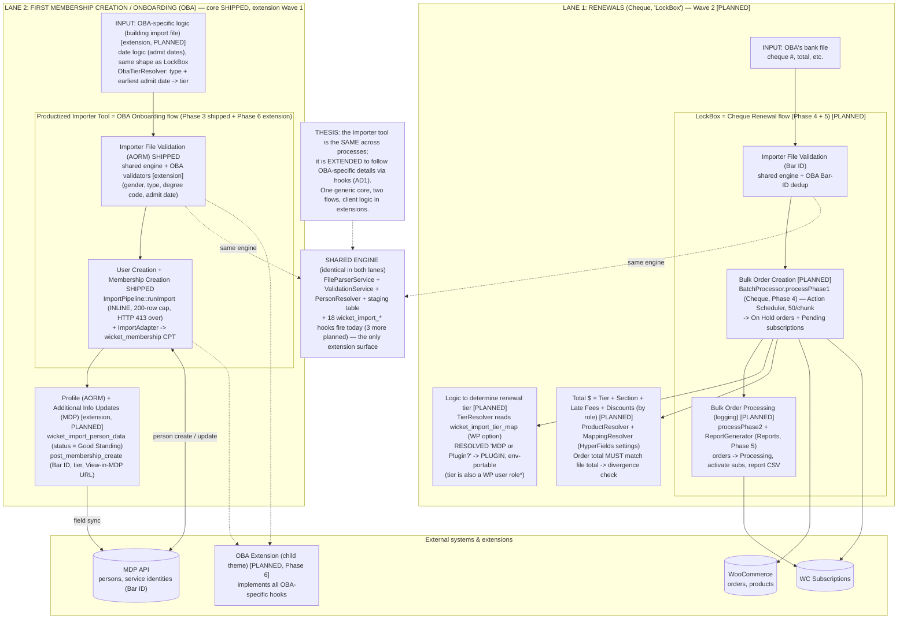
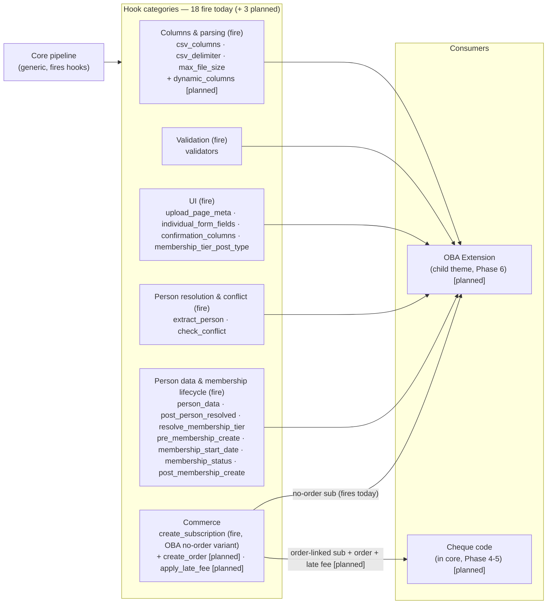
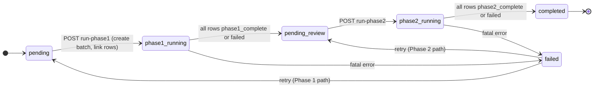

# System Flow Diagrams

Visual maps of how the importer works. Mirrors the original hand-drawn two-lane flow, enriched with the implementation. Text detail lives in [import pipeline](import-pipeline.md) and [hooks](hooks.md); this page is the at-a-glance visual companion.

> **How to read this page.** These diagrams describe the **intended end-state architecture** (the two-lane thesis). Status badges mark what **ships today** (Phase 0-3) versus what is **planned** (Phase 4-6). Where a class or hook is not yet built, it is tagged `[PLANNED]`. The authoritative, code-verified reference for hooks is [hooks](hooks.md); this page must stay a subset of it. When a diagram and the code disagree, **the code wins**. Current build status is in [roadmap](roadmap.md).

## Legend

| Shape / line | Meaning |
|---|---|
| `[box]` | component or step |
| `{diamond}` | decision |
| `[(cylinder)]` | data store (DB table or external API) |
| dotted `-.->` | a shared engine, or a `wicket_import_*` hook firing into the extension layer |
| solid `-->` | data or control flow |

---

## 1. Two-lane system map

The importer is the SAME tool across two processes; it is EXTENDED to follow client-specific details via hooks (AD1). One generic core, two flows, client logic in extensions.

Build status (see [roadmap](roadmap.md)):
- **Lane 1 (Cheque / LockBox)** = Phase 4-5 = **Wave 2, `[PLANNED]`**. None of `Cheque\BatchProcessor`, `TierResolver`, `ProductResolver`, `MappingResolver`, `ObaTierResolver`, `Reports\ReportGenerator` exist yet; the `wicket_import_batches` schema is in place but no code drives it.
- **Lane 2 (Onboarding)** = Phase 3 (core pipeline) **SHIPPED** + Phase 6 (OBA extension, child theme) **`[PLANNED]`, Wave 1 next**. The OBA extension itself does not exist yet; `ImportPipeline::runImport()` and `ImportAdapter` are the shipped core it will hook into.



\* Tier is resolved via `wicket_import_resolve_membership_tier` (extension hook, default `0`). Discounts/fees are role-based; the planned `MappingResolver` would load roles fresh from DB (not stale member data). There is no `TierResolver` / `wicket_import_tier_map` option in core today; both are Phase 4 scope.

### Hand-drawn original to implementation mapping

The "Planned implementation" column names the class/hook each original element maps to. Items tagged **[shipped]** exist in `src/` today; the rest are Phase 4-6 roadmap tasks (see [roadmap](roadmap.md)).

| Original element | Lane | Planned implementation |
|---|---|---|
| OBA's bank file (cheque #, total) | Renewals | Cheque CSV input, Phase 4 task 15.0 `[planned]` |
| LockBox: Importer File Validation (Bar ID) | Renewals | FileParserService + ValidationService **[shipped]** + OBA Bar-ID dedup `[planned]` |
| LockBox: Bulk Order Creation | Renewals | `Cheque\BatchProcessor::processPhase1` (Action Scheduler) `[planned]` |
| LockBox: Bulk Order Processing (logging) | Renewals | `processPhase2` + `Reports\ReportGenerator` `[planned]` |
| Logic to determine renewal tier + "(MDP or Plugin?)" | Renewals | `TierResolver` on WP option `[planned]`. Resolved: plugin-side, env-portable |
| Total $ = Tier + Section + Late Fees + Discounts | Renewals | `ProductResolver` + `MappingResolver` (HyperFields) `[planned]` |
| Order total must match file total | Renewals | total divergence check on ReviewPage `[planned]` |
| OBA import file logic (date logic) | Onboarding | `ObaTierResolver` admit-date mapping `[planned, extension]` |
| Productized Importer Tool: Validation (AORM) | Onboarding | FileParserService + ValidationService **[shipped]** + OBA validators `[planned, extension]` |
| Productized Importer Tool: User + Membership Creation | Onboarding | `ImportPipeline::runImport` **[shipped]** + `ImportAdapter` **[shipped]** |
| Profile (AORM) + Additional Info Updates (MDP) | Onboarding | `wicket_import_person_data` **[shipped]** + `wicket_import_post_membership_create` **[shipped]** (OBA populates them in Phase 6) |
| Note: same tool, extended for OBA | both | AD1: generic core, client logic via hooks **[shipped]** |

---

## 2. Shared engine and extension hook surface

Why it is one tool. The core has zero client domain knowledge; every customization is a `wicket_import_*` hook. This shows the hook categories, which fire today, and who will consume them.

**18 hooks fire today; 3 more are documented as planned** (`dynamic_columns`, `create_order`, `apply_late_fee` — the cheque/LockBox additions). Full signatures + fired/planned status: [hooks](hooks.md).



> The hook names above are the **exact** filter/action names. Earlier drafts abbreviated them (`start_date`, `status`, `resolve_tier`); the real names include the `membership_` prefix — see [hooks](hooks.md).

---

## 3. LockBox (Cheque) batch lifecycle `[PLANNED — Phase 4-5, Wave 2]`

The `wicket_import_batches` record is **designed** to drive a two-phase cheque flow. The table schema ships today (status + phase1/phase2 counters + timestamps), but **no code transitions these states yet** — `Cheque\BatchProcessor` and its REST controller are Phase 4-5. Treat the state machine below as the intended design, not current behavior. Each phase is an Action Scheduler loop that reschedules itself until rows are exhausted.



Row-level `import_status` within a batch (cheque, planned): `pending` -> `processing` -> `phase1_complete` (or `needs_review` / `failed`) -> `phase2_complete` (or `needs_review` / `failed`).

The **shipped** OBA flow uses this lifecycle instead:

```
pending -> processing (atomic claim) -> imported | updated | skipped | skipped_active_membership | email_conflict | needs_review | failed
```

`needs_review` on the OBA flow means a post-RESOLVED failure (ImportAdapter error, or pipeline exception after the MDP person was created/merged) — the orphan-person / stale-WP-relationship case that an admin must address manually. The `processing` state is the atomic claim (`claimImportableInSession`) that prevents two parallel `/run` calls from driving the same rows; it is excluded from re-runs.

---

## Key design rules (encoded in the diagrams)

- **AD1:** core stays generic. OBA logic will live in the child-theme extension (Phase 6); cheque logic will live in core (Phase 4-5) but subscribes to its own hooks internally. Two flows, one core.
- **AD6:** two processors, no shared path. OBA = `ImportPipeline::runImport()` inline (200-row cap, HTTP 413 over) — **shipped**. Cheque = `BatchProcessor` + Action Scheduler (50/chunk) from day one — `[planned]`.
- **AD10:** `ImportAdapter` fires `wicket_import_create_subscription`; core never calls WC Subscriptions directly.
- **AD11:** `wicket_import_person_data` filter fires before every MDP create/update (avoids a double PATCH per row).
- **AD12:** `runConflictCheck` is a thin shell + `wicket_import_check_conflict` filter (the OBA 4-tier dedup).
- **AD14:** every CSV export prefixes cells starting with `= + - @ tab CR` with a tab. Injection-safe.
- **Sequencing:** Wave 1 ships the OBA extension (Phase 6) on top of the shipped core pipeline (Phase 0-3); Wave 2 adds cheque (Phase 4-5). See [roadmap](roadmap.md).
